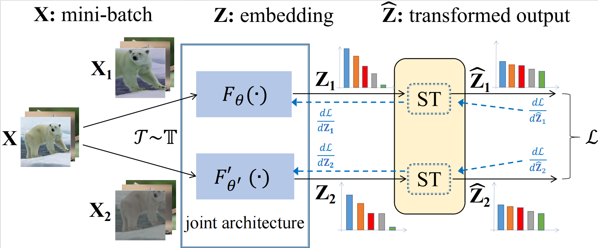

# Modulate Your Spectrum in Self-Supervised Learning

<p align="center">
  
</p>

This is an official implementation of [INTL](https://arxiv.org/abs/2305.16789).

```
@article{weng2023modulate,
  title={Modulate Your Spectrum in Self-Supervised Learning},
  author={Weng, Xi and Ni, Yunhao and Song, Tengwei and Luo, Jie and Anwer, Rao Muhammad and Khan, Salman and Khan, Fahad Shahbaz and Huang, Lei},
  journal={arXiv preprint arXiv:2305.16789},
  year={2023}
}
```

## Requirements
- Install PyTorch ([pytorch.org](http://pytorch.org))
- Install wandb for Logging ([wandb.ai](https://wandb.ai/)) 

## Experiments on Standard SSL Benchmark
The code includes experiments in section 5. 

### Evaluation on ImageNet

Our pretrained ResNet-50 INTL (using multi-crop and EMA):

<table>
  <tr>
    <th>epochs</th>
    <th>bs</th>
    <th>top-1 acc</th>
    <th colspan="4">download</th>
  </tr>
  <tr>
    <td>100</td>
    <td>256</td>
    <td>73.5%</td>
    <td><a href="scripts/ep100_multi-crop_ema.sh">script</a></td>
    <td><a href="https://drive.google.com/file/d/1DZVKlqWaRJ7Xkq9g4rDoVOfClRtIa0Uk/view?usp=drive_link">ResNet-50</a></td>
    <td><a href="https://drive.google.com/file/d/1zemhf-UbzcmpteAB5nKEv7r4dWbYINLP/view?usp=drive_link">full checkpoint</a></td>
    <td><a href="https://drive.google.com/file/d/1khGuJ37B6yEl1ME4Bc9WYikO3Hh8a7vK/view?usp=drive_links">lincls checkpoint</a></td>
  </tr>
  <tr>
    <td>200</td>
    <td>256</td>
    <td>75.2%</td>
    <td><a href="scripts/ep200_multi-crop_ema.sh">script</a></td>
    <td><a href="https://drive.google.com/file/d/1H6i__9IYkX4VYcMILY-8JgHQY1m_aUlP/view?usp=drive_link">ResNet-50</a></td>
    <td><a href="https://drive.google.com/file/d/1MQlwD1Ep6oMCpDrz3T7Ih4DCRe9fwGg3/view?usp=drive_link">full checkpoint</a></td>
    <td><a href="https://drive.google.com/file/d/1WmtWxULXPiTPq_NWTv_ceXGouUCoVAX-/view?usp=drive_link">lincls checkpoint</a></td>

  </tr>
  <tr>
    <td>400</td>
    <td>256</td>
    <td>76.1%</td>
    <td><a href="scripts/ep400_multi-crop_ema.sh">script</a></td>
    <td><a href="https://drive.google.com/file/d/1CsowRCBNL6zTvjXe2PKhVOiDIGP-2to1/view?usp=drive_link">ResNet-50</a></td>
    <td><a href="https://drive.google.com/file/d/1PUoGL0fr-WbtWkbk9gopSr7vO_kA2S9z/view?usp=drive_link">full checkpoint</a></td>
    <td><a href="https://drive.google.com/file/d/1M40oIQFvMYXZCeOMba23fqIUxmYDCQTg/view?usp=drive_link">lincls checkpoint</a></td>
  </tr>
  <tr>
    <td>800</td>
    <td>256</td>
    <td>76.6%</td>
    <td><a href="scripts/ep800_multi-crop_ema.sh">script</a></td>
    <td><a href="https://drive.google.com/file/d/1zHZPpHjMKnzwHyOD93cuRO0o8QMbWnxV/view?usp=drive_link">ResNet-50</a></td>
    <td><a href="https://drive.google.com/file/d/1wLN1I4kXJtbmuRH1HKHE5snp6S-MtNLR/view?usp=drive_link">full checkpoint</a></td>
    <td><a href="https://drive.google.com/file/d/1wKeEKcGojfHYhdLh24f8VhmY6ZXuD8Fw/view?usp=drive_link">lincls checkpoint</a></td>
  </tr>
</table>

Our pretrained ResNet-50 INTL (without multi-crop or EMA):

<table>
  <tr>
    <th>epochs</th>
    <th>bs</th>
    <th>top-1 acc</th>
    <th colspan="4">download</th>
  </tr>
  <tr>
    <td>800</td>
    <td>256</td>
    <td>73.1%</td>
    <td><a href="scripts/ep800.sh">script</a></td>
    <td><a href="https://drive.google.com/file/d/1wkc1q6Pb-ZOLrBA36TyYsrOQPz8zLKtm/view?usp=drive_link">ResNet-50</a></td>
    <td><a href="https://drive.google.com/file/d/19rpjQkG3op-cclvj5214a3roQZvcUT_c/view?usp=drive_link">full checkpoint</a></td>
    <td><a href="https://drive.google.com/file/d/1MrBE_pwrq1hVKuc2307sqWT30kXvywY2/view?usp=drive_link">lincls checkpoint</a></td>
  </tr>
</table>

You can choose to download either the weights of the pretrained ResNet-50 network or the full checkpoint, which also contains the weights of the projection and the state of the optimizer.

### Evaluation on small and medium size datasets.
The datasets include CIFAR-10, CIFAR-100 and ImageNet-100.

The results and unsupervised pretraining scripts are shown in the following table:

<table>
  <tr>
    <th colspan="4">CIFAR-10</th>
    <th colspan="4">CIFAR-100</th>
    <th colspan="4">ImageNet-100</th>
  </tr>
  <tr>
    <td>top-1</td>
    <td>5-nn</td>
    <td>top-5</td>
    <td>script</td>
    <td>top-1</td>
    <td>5-nn</td>
    <td>top-5</td>
    <td>script</td>
    <td>top-1</td>
    <td>5-nn</td>
    <td>top-5</td>
    <td>script</td>
  </tr>
  <tr>
    <td>92.60</td>
    <td>90.03</td>
    <td>99.80</td>
    <td><a href="scripts/cifar10.sh">script</a></td>
    <td>70.88</td>
    <td>61.90</td>
    <td>92.13</td>
    <td><a href="scripts/cifar100.sh">script</a></td>
    <td>81.68</td>
    <td>73.46</td>
    <td>95.42</td>
    <td><a href="scripts/in100.sh">script</a></td>
  </tr>
</table>

### Transferring to Object Detection
Same as [MoCo](https://github.com/facebookresearch/moco) for object detection transfer, please see [./detection](https://github.com/winci-ai/INTL/tree/main/detection).

Transfer learning results of INTL (200-epochs pretrained on ImageNet):
| downstream task |$AP_{50}$| $AP$ | $AP_{75}$ |ckpt|log|
| :----:  |:------:| :--: | :--: | :--: | :--: |
| COCO detection| $61.2_{±0.08}$|$41.2_{±0.12}$ | $44.7_{±0.19}$|[coco_ckpt](https://drive.google.com/file/d/1W9IYeNvNmCDCDK3cSgYLZDogm0c1ijuQ/view?usp=drive_link) |[coco_log](https://drive.google.com/file/d/15dfEx1DG-f8mmQm4wnh8XrMdQE3NvyOa/view?usp=drive_link)|
| COCO instance seg.| $57.8_{±0.04}$|$35.7_{±0.05}$ | $38.1_{±0.12}$|[coco_ckpt](https://drive.google.com/file/d/1W9IYeNvNmCDCDK3cSgYLZDogm0c1ijuQ/view?usp=drive_link) | [coco_log](https://drive.google.com/file/d/15dfEx1DG-f8mmQm4wnh8XrMdQE3NvyOa/view?usp=drive_link)|
